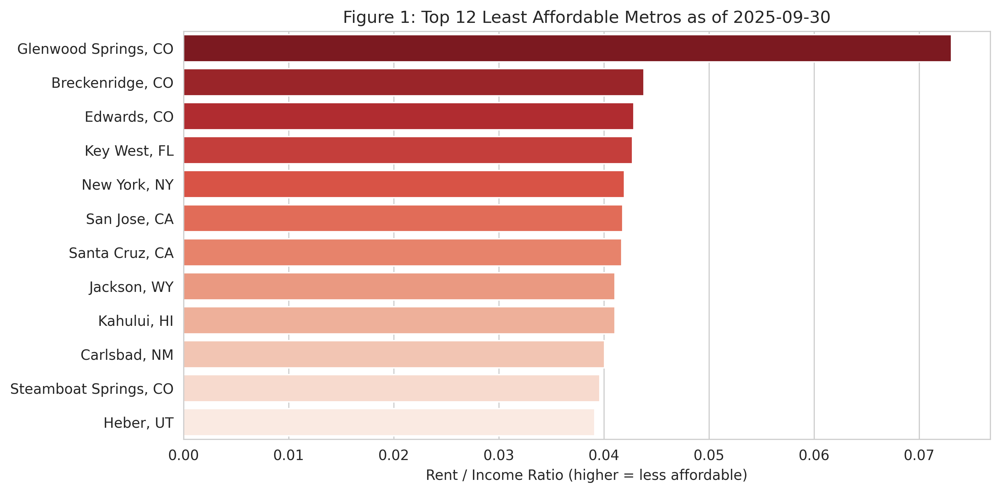
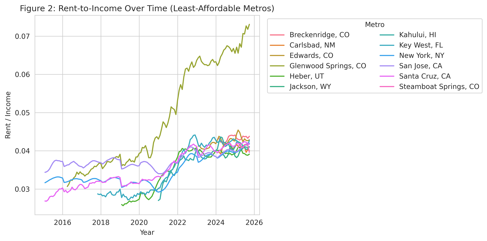
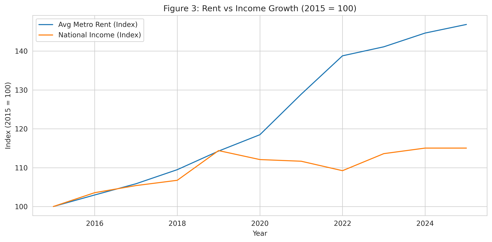
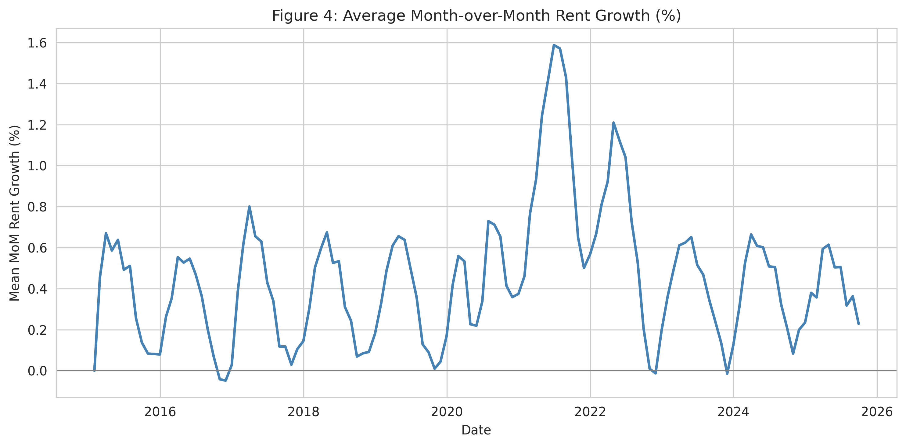
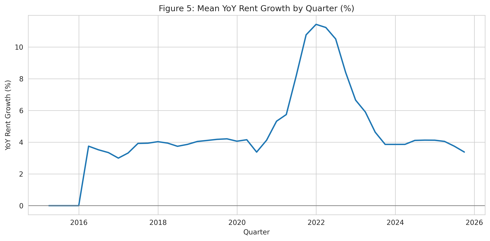
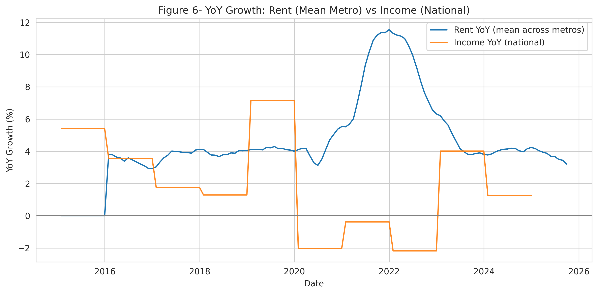
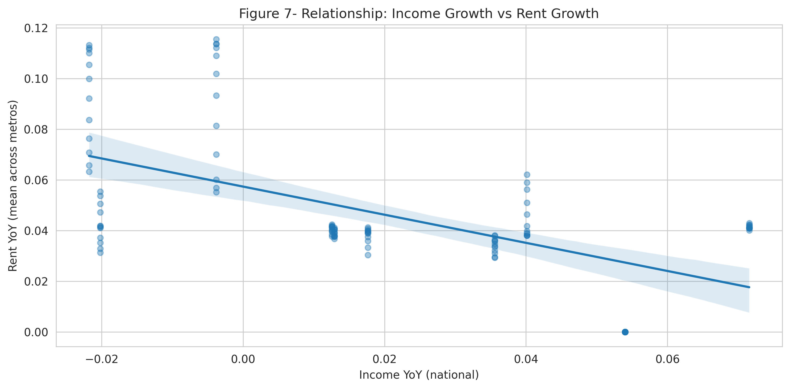
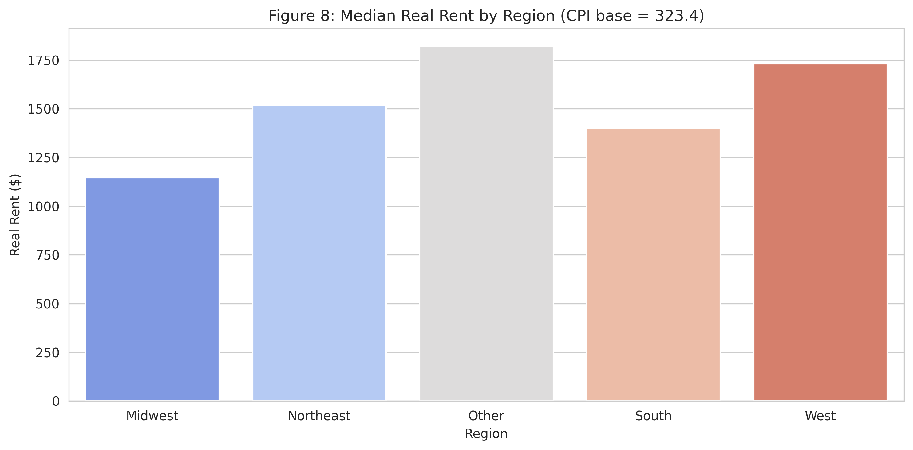
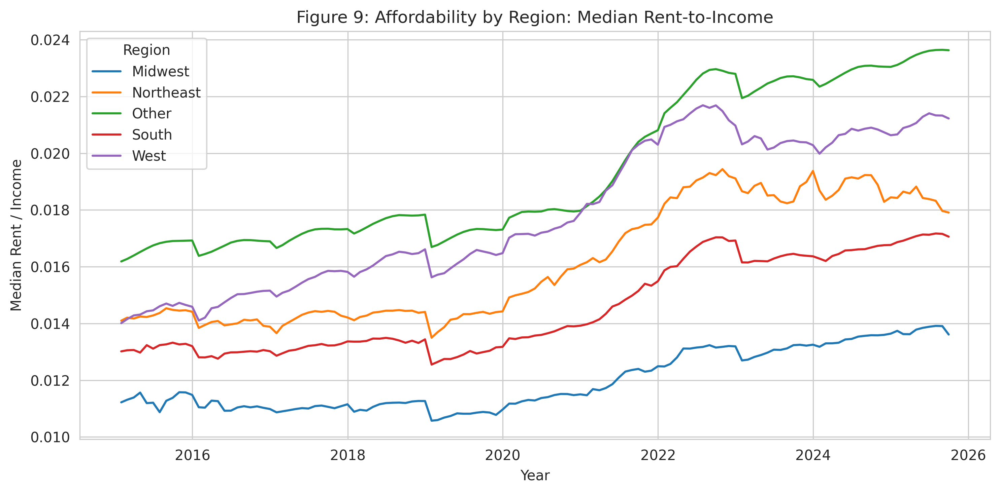
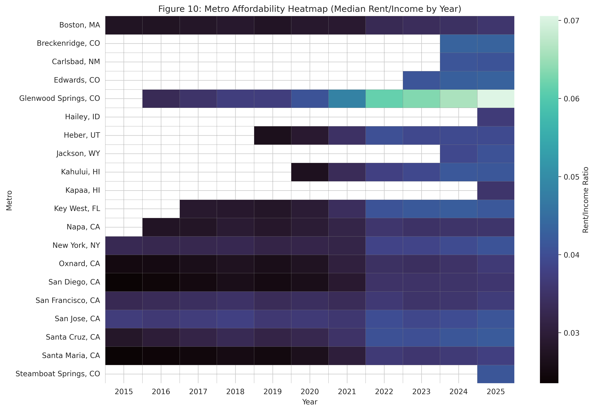

# U.S. Rental Affordability Analysis (2015–2025)

**Author:** Sejona Sujit Das  
**Course:** Data Bootcamp (Fall 2025, NYU Stern)  
**Notebook:** `housing_affordability.ipynb`  
**Dataset:** Zillow Observed Rent Index (ZORI), FRED Median Household Income (MEHOINUSA672N), and FRED Consumer Price Index (CPIAUCSL)

---

## Project Overview

This project examines the trends of **housing affordability in the United States from 2015 through 2025**. It combines **Zillow’s Observed Rent Index (ZORI)** with **median household income** and **consumer prices** from the **Federal Reserve Economic Data (FRED)** to measure how rental costs and household earnings evolved over time and across regions. By **adjusting for inflation** using CPI, the analysis distinguishes nominal price movements from real purchasing, that is, power trends, providing a clearer view of affordability pressures.

We address three research questions:

1. **Which U.S. metros are the least affordable, where rents consume the largest share of income?**  
2. **Has rent growth outpaced income growth since 2015, and during which periods?**  
3. **How has affordability evolved across regions once adjusted for inflation?**

Across a set of visual analyses, the study documents **long-run affordability decline**, **sharp post-2020 rent surges**, and **persistent regional gaps**, with evidence that rents have grown structurally faster than incomes, especially during 2021–2022, entrenching high burdens even as growth cooled later.

---

## Methodology (Concepts & Measures)

The core affordability measure is the **Rent-to-Income ratio** at the metro level:

$$
\text{Affordability Ratio} \;=\; \frac{\text{Typical Rent (ZORI)}}{\text{Median Household Income (FRED)}}
$$

This captures the **share of monthly income** needed to pay typical market rent; **higher values = lower affordability**.

To separate inflation from underlying real trends, we also compute **real rent** by scaling nominal ZORI rents with the CPI series to a common base (latest CPI):

$$
\text{Real Rent}_t \;=\; \frac{\text{Rent}_t}{\text{CPI}_t / \text{CPI}_{\text{latest}}}
$$

Momentum metrics help characterize speed and timing:

- **MoM growth**: month-over-month rent change (short-term momentum, seasonality).  
- **YoY growth**: year-over-year rent change (longer-horizon inflation signal).

Regional comparisons use Census-style groupings (West, Northeast, Midwest, South, plus “Other” for outliers such as AK/HI/DC where applicable).

---

## Dataset & Preparation

### Sources
- **Zillow Research – Zillow Observed Rent Index - ZORI (metro level):**  
- **FRED – Median Household Income (MEHOINUSA672N):**  
- **FRED – CPI (CPIAUCSL):**  

### Structure & Features
- **ZORI (metro time series):** one row per **metro**, with columns for **State/Metro identifiers** and **monthly columns** for rent (typical observed market rate).  
- **Income (national, annual):** median U.S. household income by **calendar year** (levels, nominal dollars).  
- **CPI (monthly):** U.S. CPI index used to build **inflation-adjusted** rent.

From these, the final tidy analysis table (**`merged`**) includes the following features over thousands of rows:

- `Date` (month-end), `Year`, `Month`  
- `Metro`, `State`, `Region`  
- `Rent` (ZORI), `Rent_Real` (CPI-adjusted), `Rent_Roll3` (3-month mean)  
- `Income` (mapped annual to monthly), `Rent_to_Income`  
- `Rent_Growth_MoM`, `Rent_Growth_YoY`  
- other helper fields

### Cleaning & Alignment Steps
1. **Reshape ZORI** from wide to long/tidy format: one row per `(Metro, Date)` with a `Rent` value.  
2. **Normalize Date** to month-end timestamps to match CPI’s temporal granularity.  
3. **Attach CPI** by `Date` and compute **`Rent_Real`** using the latest CPI as base.  
4. **Map Income**: convert FRED’s **annual** income to monthly by merging on `Year`; forward-fill for the most recent years to cover all months in the rent series.  
5. **Features created**:  
   - **Affordability** `Rent_to_Income = Rent / Income`  
   - **Growth rates** `Rent_Growth_MoM = pct_change(1)`, `Rent_Growth_YoY = pct_change(12)`   
   - **Rolling means** and **log transforms** for smoother trends and diagnostics  
6. **Region Map** to compare affordability paths across U.S. regions.  

These steps ensure that this analysis/project is reproducible.

---

## Research Question 1  
### Which U.S. Metros Are the Least Affordable, where rents consume the largest share of income?

#### Figure 1: Top 12 Least Affordable Metros (as of September 2025)

This chart ranks U.S. metros by **Rent-to-Income** at the latest observation. As of **September 2025**, **Glenwood Springs, CO** is the least affordable, with rent consuming **over 7%** of the typical household’s monthly income. **Breckenridge, CO** and **Edwards, CO** follow closely, underscoring how **smaller mountain/resort metros** have become disproportionately expensive, driven by **tourism**, **post-2020 remote-work migration**, and **inelastic supply** (zoning limits and scarce buildable land).  

Large coastal metros, **New York**, **San Jose**, **Key West**, also rank as highly burdened. 

#### Figure 2: Rent-to-Income Over Time (Least-Affordable Metros)

The time paths show **broad deterioration** post-2020. Glenwood Springs exhibits the steepest climb, from ~4% in 2019 to >7% in 2025, signaling **extreme rent inflation** relative to incomes. New York and San Jose dip in early 2020 (lockdown out-migration) but **rebound quickly**, ending at historically high burdens. The persistence of elevated ratios post-2023 indicates that the post-pandemic run-up is not just cyclical; it **reset** the affordability baseline at a worse level.

**Overall Answer to Research Question 1**  
The least affordable metros cluster in **Colorado (resort/lifestyle)** and **coastal states (CA/NY/FL)**, with rent burdens in the **5–7%** range of national median income. The **2020–2022** period marked the **sharpest affordability losses**, catalyzed by migration surges and supply bottlenecks. The geography of the U.S. rental crisis has **broadened beyond major coastal hubs** to include smaller destination metros.

---

## Research Question 2  
### Has Rent Growth Outpaced Income Growth Since 2015, and during which periods?

#### Figure 3: Rent vs Income Growth (2015 = 100)

Indexing both series to 2015 reveals a widening gap. By 2025, average metro rents rose **~45%**, while national median income increased only **~15%**. The divergence starts gently (~2018) and **accelerates** after **2020** due to supply constraints, demand spikes, and inflation, **entrenching** an affordability gap. Despite higher local wages, rent escalation **outpaced income growth**, leaving affordability near decade-lows.

#### Figure 4: Average Month-over-Month Rent Growth (%)

MoM growth is **seasonal** (summer highs, winter lows) but becomes volatile post-2020. The **mid-2021 to mid-2022** window saw peaks above **1.5% per month**, about **3×** typical rates, reflecting acute overheating from construction delays (labor/materials), low vacancy, and household relocation patterns.

#### Figure 5: Mean Year-over-Year Rent Growth (%)

YoY rent inflation **peaks near 10% in 2021–2022**, then cools toward **~4%** by 2024–2025. This demonstrates price stickiness: once rents reset higher, they do not revert even as the market stabilizes.

#### Figure 6: YoY Rent vs Income Growth

Rent growth remains mostly positive, while **income growth dips negative** during **2020 and 2022**. Because rents ratchet up faster than wages adjust, downturns **widen** the gap rather than correct it, leaving households **worse off** after each shock.

#### Figure 7: Relationship Between Income Growth and Rent Growth

The scatter shows a **negative correlation (~–0.59)**: **slower income growth coincides with faster rent inflation**. This decoupling points to **supply scarcity**, **inelastic markets**, and **speculative dynamics** as primary rent drivers, not proportional wage increases.

**Overall Answer to Research Question 2**  
Yes, **rents have consistently outpaced incomes since 2015**, most dramatically in **2021–2022**. Even when nominal incomes rose, **inflation eroded purchasing power**, and rent levels remained **permanently elevated**. The data indicate a **structural, not cyclical**, imbalance: housing markets respond rapidly to shocks and scarcity; income growth lags. Affordability deterioration has therefore become **persistent** across U.S. metros.

---

## Research Question 3  
### How Has Affordability Evolved Across Regions (Inflation-Adjusted)?

#### Figure 8: Median Real Rent by Region

After CPI adjustment, regional gaps **widen** rather than disappear. The **West** posts the highest real rents (>\$1,700), followed by the **Northeast** and **Other** (AK/HI/DC cases), while the **Midwest** remains most affordable (~\$1,150). The West’s profile reflects **chronic undersupply** and **high-wage demand centers** (tech/finance), whereas the Midwest’s relative affordability derives from **more elastic supply** and slower population growth.

#### Figure 9: Affordability by Region (Median Rent-to-Income)

All regions trend upward, but the **West** and **Other** increase the most, from **~1.6% (2015)** to **>2.3% (2025)**. The **South** shows moderate rises; the **Midwest** stays comparatively stable. Post-2020, the gap between regions **widens sharply**, mirroring cost-of-living divergence and limited housing elasticity in high-growth metros.

#### Figure 10: Metro Affordability Heatmap (Median Rent/Income by Year)

This heatmap shows how affordability evolved across 20 major U.S. metros between 2015 and 2025, where darker shades represent higher rent burdens. The chart highlights a sharp and synchronized affordability deterioration from **2021 through 2023**, marking the peak of the post-pandemic housing crisis. Darker bands in **2021–2023** indicate a synchronized national affordability shock. Metros such as Glenwood Springs (CO), Steamboat Springs (CO), and San Jose (CA) remain persistently dark (burdens **>6–7%**), while places like Edwards (CO) or Jackson (WY) show milder or shorter episodes, highlighting local resilience differences arising from supply responsiveness, migration flows, and labor-market composition.

**Overall Answer to Research Question 3**  
Even after inflation adjustment, **affordability deteriorated in every region**. The **West** is the most severely and **persistently** burdened; the **Northeast** and **South** also rose materially, while the **Midwest** remains relatively affordable but shows **gradual erosion**. Inflation-adjusted rent levels climbing faster than real incomes confirm that affordability challenges are **structural**, not transient.

---

## Key Findings & Conclusions

- **Nationwide Affordability Decline:** Rent-to-income ratios rose across almost all metros, especially after 2020.  
- **Rents Outpaced Incomes:** Since 2015, rent levels grew roughly **3× faster** than incomes, cementing a lasting gap.  
- **Regional Inequality:** The **West** is least affordable; the **Midwest** most affordable, though both moved upward.  
- **Post-Pandemic Persistence:** The 2021–2022 surge **reset** rent levels; subsequent cooling did **not** restore pre-pandemic affordability.  
- **Inflation-Adjusted Reality:** Real (CPI-adjusted) rents still **outstrip** real income gains, underscoring **supply constraints** and **inelastic markets**.

Overall, the evidence points to a **structural imbalance** between **housing supply** and **household income growth**. Without sustained policy efforts, zoning reform, accelerated construction, and income supports, the affordability gap is poised to persist into the next decade.

---

## Data Sources

- **Zillow Research — Zillow Observed Rent Index (ZORI):**  
  Metro CSV: `https://files.zillowstatic.com/research/public_csvs/zori/Metro_zori_uc_sfrcondomfr_sm_month.csv`
- **FRED — Median Household Income:**  
  Series: **MEHOINUSA672N** — `https://fred.stlouisfed.org/series/MEHOINUSA672N`
- **FRED — Consumer Price Index (CPI):**  
  Series: **CPIAUCSL** — `https://fred.stlouisfed.org/series/CPIAUCSL`

**Tools:** Python (`pandas`, `matplotlib`, `seaborn`) on Google Colab  
**Author:** Sejona Sujit Das, NYU Stern Data Bootcamp (Fall 2025)
